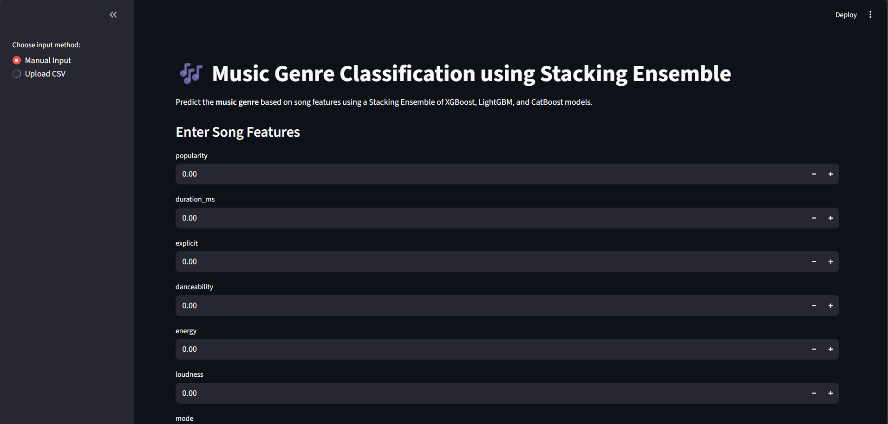
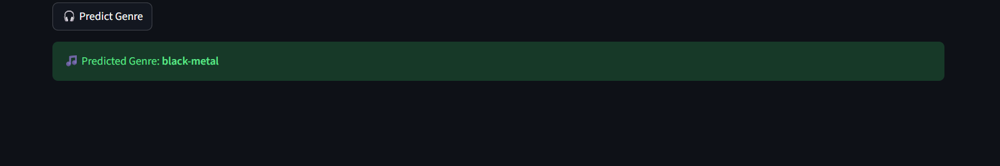
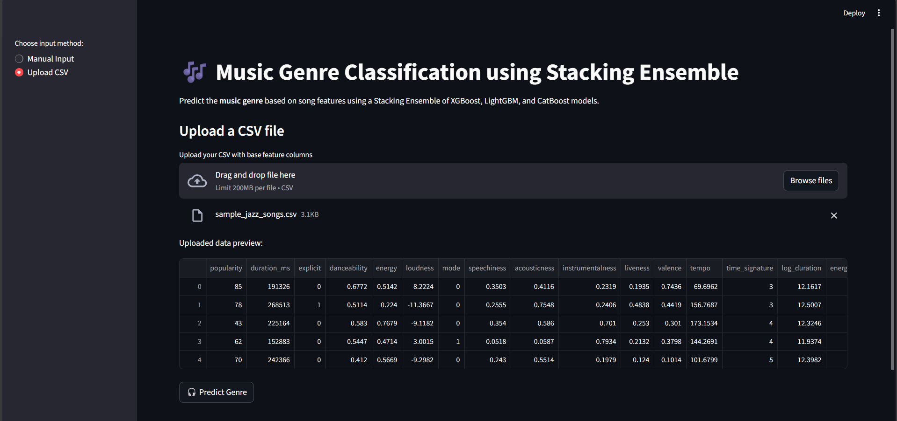
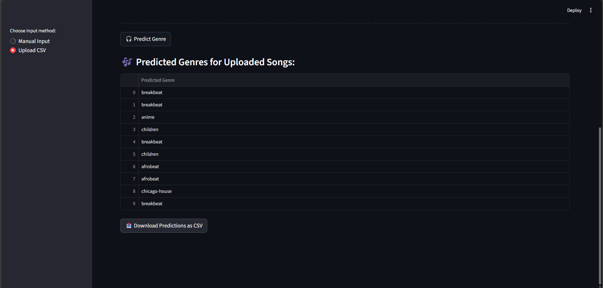

# 🎶 Music Genre Classification App

This project is a **Streamlit-based web application** that predicts the **genre of a song** based on its audio features. It uses a **stacking ensemble model** that combines the power of XGBoost, LightGBM, and CatBoost to provide high-accuracy predictions.

Users can manually input song features or upload a CSV file with multiple songs to classify genres in bulk.

---

## 🚀 Features

- 🎧 **Manual Input** – Enter individual song features for instant genre prediction.
- 📂 **CSV Upload** – Upload a CSV file to predict genres for multiple songs at once.
- 🔄 **Automated Preprocessing** – Handles feature engineering, scaling, imputing, and encoding.
- 🤖 **Advanced Machine Learning Model** – Stacking ensemble of XGBoost, LightGBM, and CatBoost.
- 🖥️ **Interactive UI** – Built with Streamlit for easy and fast use.

---

## 🛠️ Built With

- **Python**
- **Streamlit** – User interface
- **Pandas, NumPy** – Data handling
- **Scikit-learn** – Preprocessing and model persistence
- **XGBoost, LightGBM, CatBoost** – Machine learning models
- **Joblib** – Loading saved models

---

## 📦 Installation & Usage

### 🔧 Prerequisites
- Python 3.8+
- Pip package manager

### 🧑‍💻 Set Up Locally

```bash
# Clone the repository
git clone https://github.com/02Tirtha/MusicGenerPrediction.git
cd MusicGenerPrediction

# Install necessary Python packages
pip install -r requirements.txt

# Run the Streamlit app
streamlit run app.py
```

## 🧠 How the Model Works

This app uses a **stacking ensemble** combining:

- XGBoost
- LightGBM
- CatBoost

These models were trained on engineered audio features, and their predictions were fed into a meta-classifier for better accuracy.


---
### 📁 Project Structure
```bash
📁 your-project-folder/
│
├── app.py                  # Streamlit app script
├── stack_model_new.pkl     # Trained ensemble model
├── label_encoder_new.pkl   # Label encoder for genres
├── scaler_new.pkl          # Feature scaler
├── imputer.pkl             # Data imputer
├── requirements.txt        # Python dependencies
└── README.md               # Project documentation
```
---
## 📸 Screenshots

### 📝 Feature Input Form
> 

---

### 🎯 Prediction Result
> 

---

### 📂 CSV Upload Interface
> 
---

### 📊 Prediction Table
> 

---
## 📊 Example Visuals

The app interface includes:

- **Song feature inputs**
- **Genre prediction outputs**
- **CSV upload support**

---
## 🤝 Contributing

Contributions are welcome!  
To get started:

1. Fork the repository
2. Create your feature branch (`git checkout -b feature-YourFeature`)
3. Commit your changes (`git commit -m 'Add YourFeature'`)
4. Push to the branch (`git push origin feature-YourFeature`)
5. Open a pull request

---

## 💬 Feedback and Contributions

Feel free to fork, raise issues, or contribute improvements!


---
